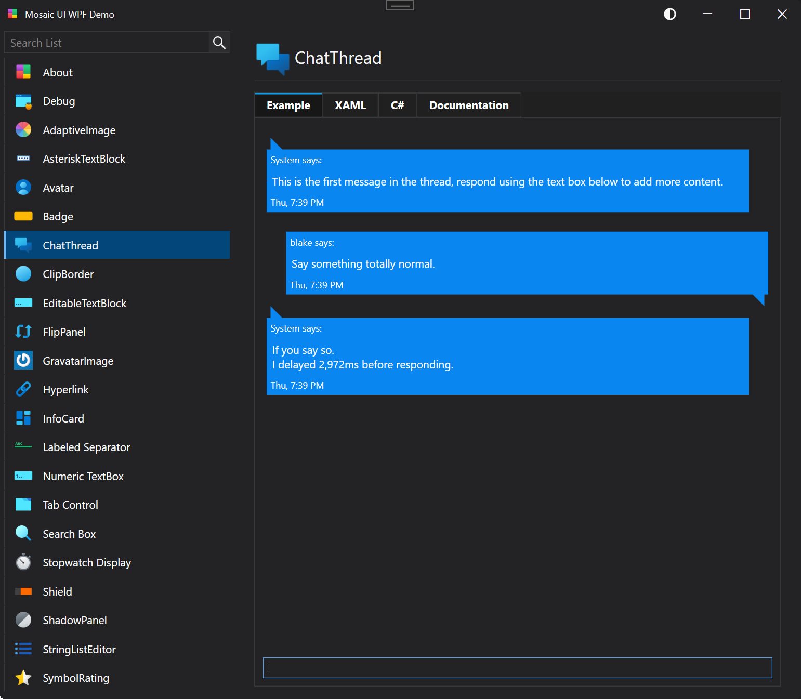
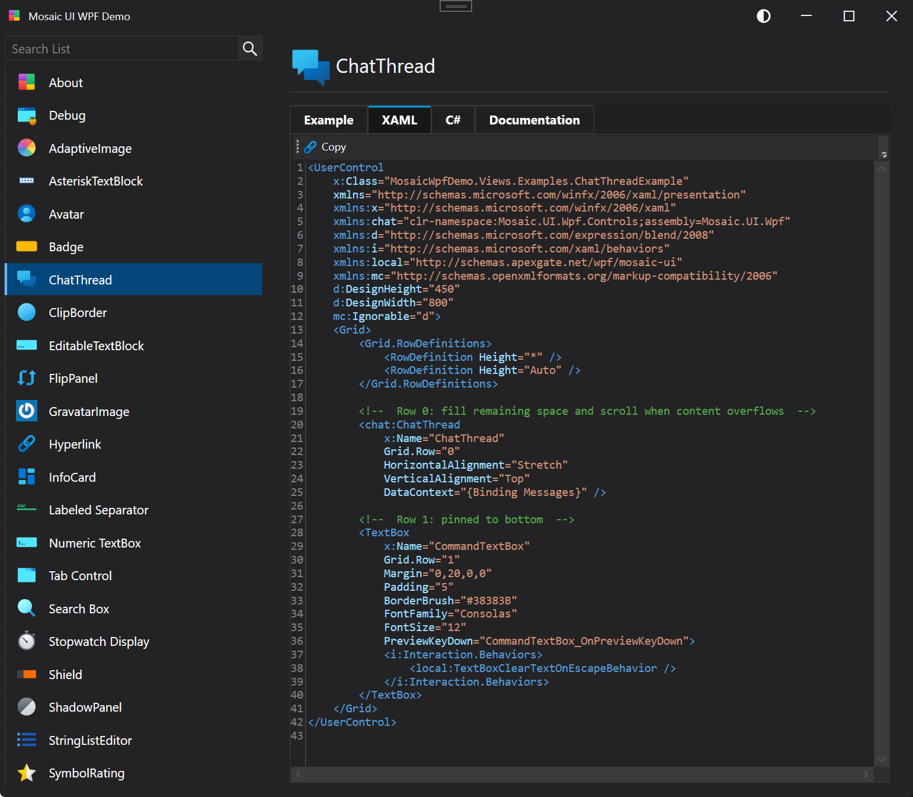

#  Mosaic UI for WPF

Mosaic UI for WPF is a control library that seeks to provide compartmentalized controls that if needed could be easily extracted from this project and included in your own.

Almost every WPF UI kit contains a way to theme that's custom and unique to their framework, it makes mixing and matching controls sometimes cumbersome. This project is trying to provide enough themeing options that you could use it by itself but not tether all of the controls to it so you could include it, or parts of it in other projects that use other UI libraries.  I'll also be providing basic examples of how to use each control so you've got a copy/paste reference to start from and a working demo app to quickly browse and try out controls.

WPF is a great, mature technology that will be with us for a long time now that's part of .NET Core.  WPF's longevity and potential longevity is one of the strengths of it.  If you're writing a hobby project you want to be around in 10 years, WPF is a great choice.  Credit to the dotnet developer team for bringing it the modern .NET stack.

If you find this project interesting or useful, please give it a star.

**Note**: There will be frequent changes to the styles in the initial part of this project.

## Dark Theme

## Light Theme

## Solution Projects

| Feature                | Description                                                                                                                            |
|------------------------|-----------------------------------------------------------------------------------------------------------------------------------------|
| Mosaic.UI.Wpf          | The control library.                                                                                                                    |
| MosaicWpfDemo          | The main demo project that houses examples and snippets of each control in the library as well as usage of other types and behaviors.   |

## Included Controls

The following table lists the controls found in `src/Mosaic.UI.Wpf/Controls` and their class descriptions (from XML comments).

| Control | Description |
|---|---|
| AdaptiveImage | Image that adapts its colors to match app/OS theme. Intended purpose is to be used for icons to be able to adapt. |
| AsteriskTextBlock | A text block that displays asterisks for each character in its text property. |
| Avatar | Represents a customizable avatar control that displays content with support for corner radius and template selection. |
| Badge | A badge component. |
| BindablePasswordBox | Represents a password input control that supports data binding for the password value. |
| ChatThread | A thread of sent and received messages like a text messaging app thread. |
| ClipBorder | Border which allows Clipping to its border. Useful especially when you need to clip to round corners. |
| ColorPicker | A color picker UserControl that allows users to select colors from presets or enter hex values. |
| EditableTextBlock | Represents a control that displays text in a non-editable mode and allows users to switch to an editable mode to modify the text. |
| FlipPanel | A flip panel component that can display two different content sides and animate between them. |
| GravatarImage | Displays a Gravatar Image for a specified email address. |
| Hyperlink | Represents a hyperlink control that displays text and provides navigation functionality. |
| InfoCard | An info card with a highlight color on the left hand side. |
| LabeledSeparator | A labeled separator. |
| NumericTextBox | TextBox that only allows digits, minus sign and a decimal point. |
| SearchBox | A custom TextBox tailored for searching or filtering. |
| ShadowPanel | A panel control that applies a drop shadow effect to its child content. Provides properties to control shadow elevation and density/thickness. |
| Shield | A shield component (shows a property and a value). |
| SideMenu | Represents a side menu control that displays a collection of menu items and allows item selection. |
| SimpleStackPanel | Arranges child elements into a single line that can be oriented horizontally or vertically that is more efficient that the normal StackPanel. |
| StopwatchDisplay | Represents a stopwatch control that provides functionality to display a stopwatch timer as UI element. |
| StringListEditor | A StringListEditor component. |
| SymbolRating | A symbol rating component. |
| TabControl | Represents a tab control that allows users to switch between multiple tabs. |
| ToggleSwitch | Represents a toggle switch control that allows users to switch between two states, such as "On" and "Off". |
| TypingProgress | Three bubble animated indicator for use indicating when a user is typing. |
