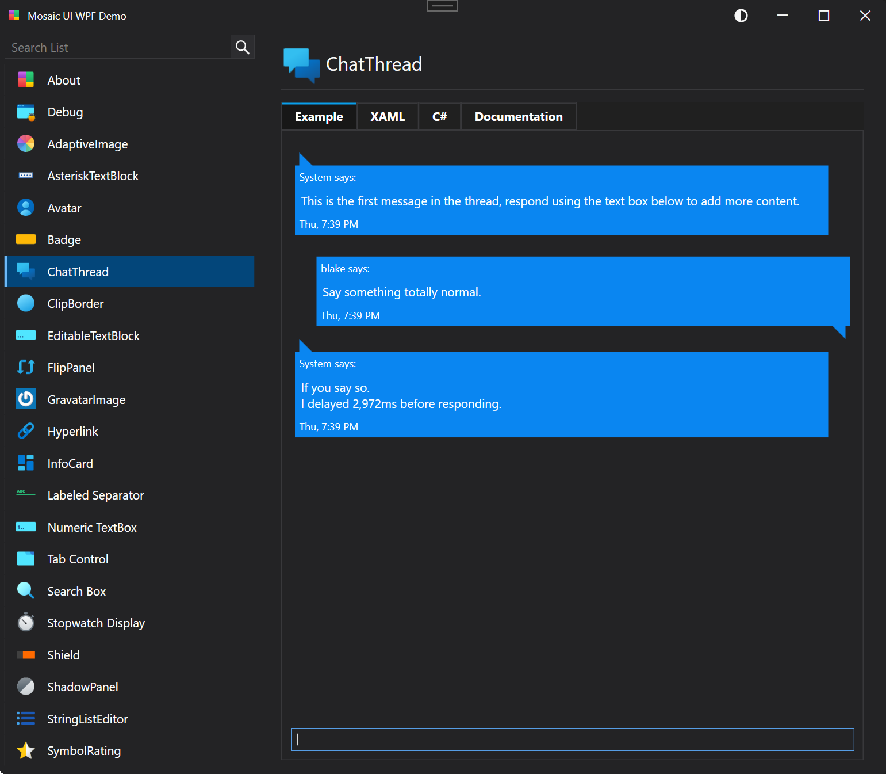
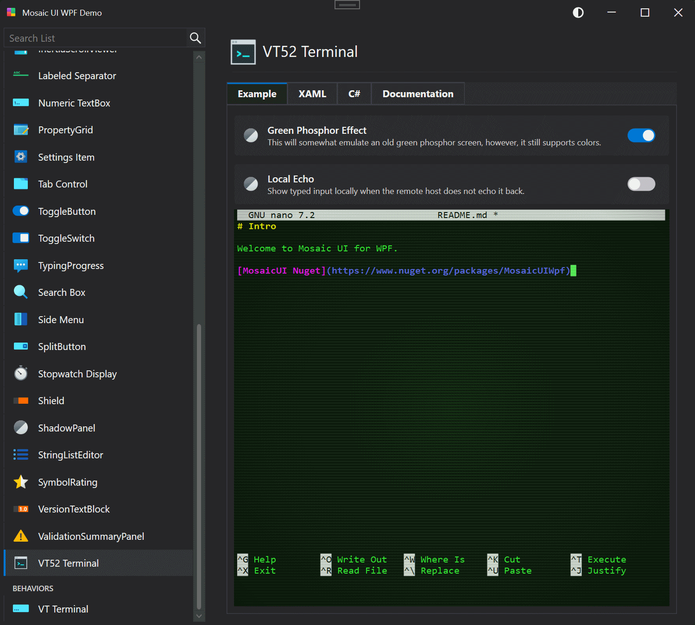
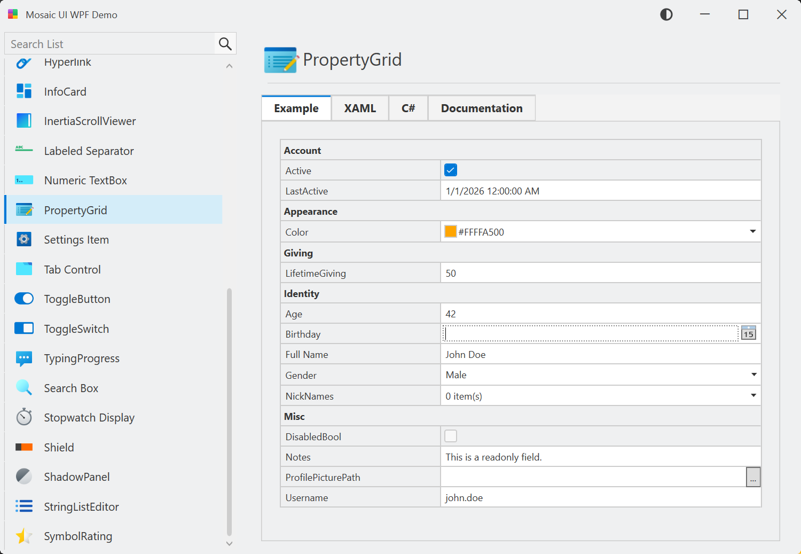
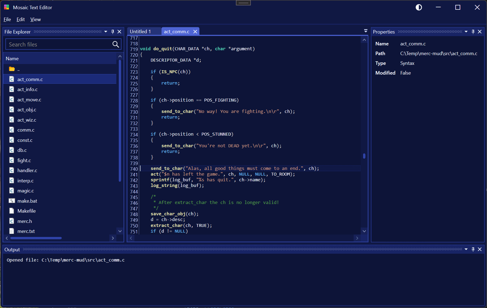

# <span> Mosaic UI for WPF</span>

Mosaic UI for WPF is a control library that seeks to provide compartmentalized controls that if needed could be easily extracted from this project and included in your own.

Almost every WPF UI kit contains a way to theme that's custom and unique to their framework, it makes mixing and matching controls sometimes cumbersome. This project is trying to provide enough themeing options that you could use it by itself but not tether all of the controls to it so you could include it, or parts of it in other projects that use other UI libraries.  I'll also be providing basic examples of how to use each control so you've got a copy/paste reference to start from and a working demo app to quickly browse and try out controls.

WPF is a great, mature technology that will be with us for a long time now that's part of .NET Core.  WPF's current and future longevity are one of its strengths.  If you're writing a hobby project you want to be around in 10 years, WPF is a great choice.  Credit to the dotnet developer team for bringing it the modern .NET stack.

If you find this project interesting or useful, please give it a star.

> Note: Expect frequent updates to the styling system during the early stages of this project.
> I’m currently exploring various theming patterns through a process of experimentation. I've concluded that customizing the default control templates for native WPF controls is necessary; these will be provided in a separate ResourceDictionary.
> Previously, I overrode SystemColors, but this approach proved too invasive—particularly for applications aiming to coexist with other UI frameworks without conflict.  Also, there are many stock controls that use static resources or hard coded colors so SystemColors gets you some of the way there, but not all of the way

A final note, if you have a useful reusable (mostly) compartmentalized control you want to share and be creditted for, feel free to put in a pull request and I'll look at it.

## Getting Started

### Install the NuGet Package

Install the package from [NuGet](https://www.nuget.org/packages/MosaicUIWpf) using the .NET CLI:

```bash
dotnet add package MosaicUIWpf
```

Or search for **MosaicUIWpf** in the Visual Studio NuGet Package Manager.

### Set Up Your Application

**1. Update `App.xaml`** to use `MosaicApp` and merge `ThemeManager` into your application resources:

```xml
<wpf:MosaicApp
    x:Class="YourApp.App"
    xmlns="http://schemas.microsoft.com/winfx/2006/xaml/presentation"
    xmlns:x="http://schemas.microsoft.com/winfx/2006/xaml"
    xmlns:mosaic="http://schemas.apexgate.net/wpf/mosaic-ui"
    xmlns:vm="clr-namespace:YourApp.Common"
    xmlns:wpf="clr-namespace:Mosaic.UI.Wpf;assembly=Mosaic.UI.Wpf"
    x:TypeArguments="vm:AppSettings, vm:AppViewModel"
    StartupUri="MainWindow.xaml">
    <Application.Resources>
        <ResourceDictionary>
            <ResourceDictionary.MergedDictionaries>
                <mosaic:ThemeManager
                    Native="True"
                    SystemColors="True"
                    Theme="Dark" />
            </ResourceDictionary.MergedDictionaries>
        </ResourceDictionary>
    </Application.Resources>
</wpf:MosaicApp>
```

Set `Theme` to `"Light"`, `"Dark"`, or `"HighContrast"`. Set `Native="True"` to restyle built-in WPF controls. Set `SystemColors="True"` to integrate with the OS accent color.

**2. Update `MainWindow.xaml`** to apply the window chrome behavior and Mosaic theme brushes:

```xml
<Window
    x:Class="YourApp.MainWindow"
    xmlns="http://schemas.microsoft.com/winfx/2006/xaml/presentation"
    xmlns:x="http://schemas.microsoft.com/winfx/2006/xaml"
    xmlns:mosaic="clr-namespace:Mosaic.UI.Wpf.Controls;assembly=Mosaic.UI.Wpf"
    xmlns:theme="http://schemas.apexgate.net/wpf/mosaic-ui"
    theme:WindowChromeBehavior.CaptionHeight="0"
    theme:WindowChromeBehavior.CornerRadius="10"
    theme:WindowChromeBehavior.IsEnabled="True"
    theme:WindowChromeBehavior.ResizeBorderThickness="5"
    Background="{DynamicResource {x:Static theme:MosaicTheme.WindowBackgroundBrush}}"
    Foreground="{DynamicResource {x:Static theme:MosaicTheme.WindowForegroundBrush}}">

    <Grid>
        <Grid.RowDefinitions>
            <RowDefinition Height="35" />
            <RowDefinition Height="*" />
        </Grid.RowDefinitions>

        <mosaic:WindowTitleBar Grid.Row="0" IconSource="/Assets/icon.png" />

        <!-- Your content here -->
    </Grid>
</Window>
```

**3. Use controls** anywhere in your XAML with the `mosaic` namespace (`http://schemas.apexgate.net/wpf/mosaic-ui`):

```xml
xmlns:mosaic="http://schemas.apexgate.net/wpf/mosaic-ui"
```

For a complete wiring example, see `MosaicTemplateApp` in the repository.

## Dark Theme





## Light Theme



## Blue Theme (Text Editor Demo Project)



## Architecture Blueprint

See `docs/ARCHITECTURE_BLUEPRINT.md` for the control-library architecture, theming model, interoperability rules, accessibility baseline, and DX guidelines.

## Solution Projects

| Feature                | Description                                                                                                                            |
|------------------------|-----------------------------------------------------------------------------------------------------------------------------------------|
| Mosaic.UI.Wpf          | The control library.                                                                                                                    |
| Mosaic.UI.Wpf.AvalonDock | Mosaic-themed AvalonDock integration for IDE-style document and tool-window docking. See the [AvalonDock README](./src/Mosaic.UI.Wpf.AvalonDock/README.md). |
| MosaicWpfDemo          | The main demo project that houses examples and snippets of each control in the library as well as usage of other types and behaviors.   |

## Included Controls

The following table lists the controls found in `src/Mosaic.UI.Wpf/Controls` and their class descriptions (from XML comments).

| Control | Description |
|---|---|
| [AccentButton](./docs/AccentButton.md) | Represents a themed button that changes its accent color based on AccentButtonType (ThemeAccent, Gray, FluentGreen, FluentRed, or Default). |
| [AdaptiveImage](./docs/AdaptiveImage.md) | Image that adapts its colors to match app/OS theme. Intended purpose is to be used for icons to be able to adapt. |
| [AsteriskTextBlock](./docs/AsteriskTextBlock.md) | A text block that displays asterisks for each character in its text property. |
| [AudioPlayer](./docs/AudioPlayer.md) | An audio player control with a familiar transport layout: a centered Previous / Play-Stop / Next button row above a full-width seek slider flanked by current playback time and total track length. Backed by MediaPlayer and manages an internal playlist. |
| [AudioPlayerSpectrumAnalyzer](./docs/AudioPlayerSpectrumAnalyzer.md) | A real-time spectrum analyzer designed to pair with the AudioPlayer control. Renders frequency bands on the horizontal axis and signal strength on the vertical axis, with optional peak-hold indicators and amplitude-driven color intensity. |
| [AutoCompleteBox](./docs/AutoCompleteBox.md) | Represents an editable selection control that filters suggestions while the user types and commits a selected item. |
| [Avatar](./docs/Avatar.md) | Represents a customizable avatar control that displays content with support for corner radius and template selection. |
| [Badge](./docs/Badge.md) | A badge component. |
| [BindablePasswordBox](./docs/BindablePasswordBox.md) | Represents a password input control that supports data binding for the password value. |
| [ChatThread](./docs/ChatThread.md) | A chat thread control which shows sent and received messages in a single thread format. |
| [CheckBoxList](./docs/CheckBoxList.md) | A ListBox variant that defaults to multiple selection and displays a checkbox beside each item. |
| [ClipBorder](./docs/ClipBorder.md) | Border which allows clipping to its border. Useful especially when you need to clip to round corners. |
| [ColorPicker](./docs/ColorPicker.md) | A color picker UserControl that allows users to select colors from presets or enter hex values. |
| [ContentPanel](./docs/ContentPanel.md) | A content panel with optional header and footer areas, configurable separators, corner radius, and header/footer brushes. |
| [DatePicker](./docs/DatePicker.md) | Represents a date picker control that displays a popup calendar for date selection. |
| [DocumentContainer](./docs/DocumentContainer.md) | Displays an observable collection of closable, reorderable documents as tabs. |
| [EditableTextBlock](./docs/EditableTextBlock.md) | Represents a control that displays text in a non-editable mode and allows users to switch to an editable mode to modify the text. The control supports double-click editing, text trimming, and customizable appearance. |
| [FavoriteCheckBox](./docs/FavoriteCheckBox.md) | A checkbox that displays a single favorite symbol (defaults to ★). The symbol and its checked/unchecked colors are customizable. |
| [FileDropper](./docs/FileDropper.md) | A drop target that accepts files dragged from the operating system. Displays a prompt, an upload icon, and accepted file types. The border turns green for valid files and red for invalid files. Raises a FileDrop event when files are dropped. |
| [Files](./docs/Files.md) | A lookless control that lists the files in a directory using a three-column view (Name with shell icon, Date Modified, Size). Supports single or multiple selection, an optional file-system watcher, manual refresh, and a FileActivated event. |
| [FlipPanel](./docs/FlipPanel.md) | A flip panel component that can display two different content sides and animate between them. |
| [GravatarImage](./docs/GravatarImage.md) | Displays a Gravatar Image for a specified email address. |
| [HexColorTextBox](./docs/HexColorTextBox.md) | A ComboBox-based control that allows editing and selecting colors using hex strings (supports #RGB, #RRGGBB, #AARRGGBB) and named brushes. |
| [Hyperlink](./docs/Hyperlink.md) | Represents a hyperlink control that displays text and provides navigation functionality. |
| [InertiaScrollViewer](./docs/InertiaScrollViewer.md) | Represents a scroll viewer that supports inertia-based scrolling animations. |
| [InfoCard](./docs/InfoCard.md) | An info card with a highlight color on the left hand side. |
| [InputWaveformVisualizer](./docs/InputWaveformVisualizer.md) | Displays a waveform captured from a selectable Windows audio input device using WASAPI shared-mode capture so other applications can use the device concurrently. |
| [LabeledSeparator](./docs/LabeledSeparator.md) | A labeled separator. |
| [LoopbackWaveformVisualizer](./docs/LoopbackWaveformVisualizer.md) | Displays a waveform captured from the default Windows audio render device using WASAPI loopback capture. Follows changes to the default console render device automatically. |
| [MarkdownEditor](./docs/MarkdownEditor.md) | A self-contained markdown editor built on the Mosaic SyntaxEditor (AvalonEdit). Provides a formatting toolbar, list/heading helpers, markdown-aware key handling, an extended context menu, and document modification tracking. |
| [MarkdownViewer](./docs/MarkdownViewer.md) | A lookless, WPF-native Markdown viewer that renders Markdown text into a FlowDocument hosted in a read-only RichTextBox so formatted content can be selected and copied as rich text. |
| [MessageBox](./docs/MessageBox.md) | A themed, drop-in replacement for System.Windows.MessageBox. Mirrors the full set of Show overloads and reuses the standard WPF dialog enums. Switch with a single using alias. Honors the active Mosaic light/dark/high-contrast theme. |
| [NumericTextBox](./docs/NumericTextBox.md) | TextBox that only allows digits, minus sign and a decimal point. |
| [ProgressRing](./docs/ProgressRing.md) | A progress ring component to indicate that a long running process is occurring. |
| [PropertyGrid](./docs/PropertyGrid.md) | A control that displays the properties of an object in a grid format. |
| [RadialProgressBar](./docs/RadialProgressBar.md) | Represents a ProgressBar that renders its value as a circular arc, pie, or a ring of discrete shapes. |
| [RelativePanel](./docs/RelativePanel.md) | Defines an area within which you can position and align child objects in relation to each other or the parent panel. |
| [ScalingTextBlock](./docs/ScalingTextBlock.md) | A TextBlock that attempts to scale the font size so all text fits within the available space. MinFontSize and MaxFontSize serve as the lower and upper boundaries. |
| [SearchBox](./docs/SearchBox.md) | A custom TextBox tailored for searching or filtering. |
| [SettingsItem](./docs/SettingsItem.md) | A settings item control. |
| [ShadowPanel](./docs/ShadowPanel.md) | A panel control that applies a drop shadow effect to its child content. Provides properties to control shadow elevation and density/thickness. |
| [ShadowTextBlock](./docs/ShadowTextBlock.md) | A TextBlock that automatically applies a configurable DropShadowEffect to its text via BlurRadius, ShadowDepth, and ShadowColor. |
| [Shield](./docs/Shield.md) | A shield component (shows a property and a value). |
| [SideMenu](./docs/SideMenu.md) | Represents a side menu control that displays a collection of menu items and allows item selection. |
| [SimpleStackPanel](./docs/SimpleStackPanel.md) | Arranges child elements into a single line that can be oriented horizontally or vertically that is more efficient that the normal StackPanel. |
| [SliderRepeatButton](./docs/SliderRepeatButton.md) | A RepeatButton variant used by slider templates that exposes radius orientation metadata for themed slider repeat surfaces. |
| [SmallPanel](./docs/SmallPanel.md) | Represents a custom panel that arranges its child elements in a single layer and ensures that each child is measured and arranged within the available space. |
| [SplitButton](./docs/SplitButton.md) | Represents a split button with a primary action surface and a separate drop-down surface that opens a context menu. |
| [SplitPanel](./docs/SplitPanel.md) | A two-pane container whose panes are separated by a draggable GridSplitter. The proportion of space allocated to the first pane is controlled by the two-way SplitterPosition property (0.0–1.0). Supports both vertical (top/bottom) and horizontal (side-by-side) orientation. |
| [StopwatchDisplay](./docs/StopwatchDisplay.md) | Represents a stopwatch control that provides functionality to display a stopwatch timer as UI element. |
| [StringListEditor](./docs/StringListEditor.md) | A StringListEditor component. |
| [SymbolRating](./docs/SymbolRating.md) | A symbol rating component. |
| [SyntaxEditor](./docs/SyntaxEditor.md) | A code editor built on AvalonEdit that integrates with the Mosaic theming system and provides bundled, theme-aware syntax highlighting selected via the Language property. Includes custom key chords for commenting, uncommenting, and moving lines. |
| [SystemDropShadowChrome](./docs/SystemDropShadowChrome.md) | Creates a theme specific look for drop shadow effects. |
| [TabControl](./docs/TabControl.md) | Represents a tab control that allows users to switch between multiple tabs. |
| [TagBox](./docs/TagBox.md) | A specialized input control that turns typed text into removable, vibrantly-colored tags. Enter commits the current text as a tag, each tag has an ✕ button, and Backspace removes the last tag. Tags are surfaced through a bindable Tags collection. |
| [ToggleButton](./docs/ToggleButton.md) | Represents a button control that can switch between two states: checked and unchecked. This implementation looks like a theme styled switch. |
| [ToggleSwitch](./docs/ToggleSwitch.md) | Represents a toggle switch control that allows users to switch between two states, such as "On" and "Off". |
| [TwoPaneView](./docs/TwoPaneView.md) | Represents a container with two views that size and position content in the available space, either side-by-side or top-bottom. |
| [TypingProgress](./docs/TypingProgress.md) | Represents a control that visually indicates typing progress, typically used in chat or messaging scenarios. |
| [ValidationSummaryPanel](./docs/ValidationSummaryPanel.md) | A validation summary panel that displays all validation errors from child controls in a form. Supports both WPF's built-in validation and IDataErrorInfo/INotifyDataErrorInfo. |
| [VersionTextBlock](./docs/VersionTextBlock.md) | A TextBlock that displays an assembly version. |
| [VT52Terminal](./docs/VT52Terminal.md) | A terminal emulator hosted inside an AvalonEdit TextEditor. Call Add(string) or Add(byte[]) with remote data; call SendKey/SendString for local keystrokes. Subscribe to Transmit to get bytes that the terminal sends back. |
| [WDScrollViewer](./docs/WDScrollViewer.md) | Provides a ScrollViewer with optional animated wheel scrolling. |
| [WindowTitleBar](./docs/WindowTitleBar.md) | A self-contained custom title bar control for borderless/chrome-less WPF windows. Automatically wires up drag-to-move, double-click maximize/restore, and the standard window system buttons. |

## Included Behaviors

The following table lists the behaviors found in `src/Mosaic.UI.Wpf/Behaviors`.

| Behavior | Description |
|---|---|
| [AvalonEditBindingBehavior](./docs/AvalonEditBindingBehavior.md) | AvalonEdit TextEditor binding behavior that allows for binding of the text property, the selected text property, the selection property, and the cursor position property. |
| [AvalonEditCopyBehavior](./docs/AvalonEditCopyBehavior.md) | A behavior that enables a Button to copy text from a specified AvalonEdit TextEditor to the clipboard. |
| [AvalonEditPropertiesBehavior](./docs/AvalonEditPropertiesBehavior.md) | A behavior that allows various common properties of an AvalonEdit TextEditor to be dynamically set or bound. |
| [AvalonEditVtTerminalBehavior](./docs/AvalonEditVtTerminalBehavior.md) | A behavior that applies a retro VT/CRT terminal visual skin to an AvalonEdit TextEditor. |
| [BlinkingBehavior](./docs/BlinkingBehavior.md) | A behavior that makes any FrameworkElement blink using an opacity animation. |
| [BlockCaretBehavior](./docs/BlockCaretBehavior.md) | A behavior that replaces the standard I-beam caret in a TextBox with a full-character-width block caret, similar to terminal emulators and classic text editors. |
| [BrushModifier](./docs/BrushModifier.md) | Provides attached properties and utility methods for modifying the appearance of brushes used in WPF controls, such as lightening the background color of elements. |
| [ButtonOpenContextMenu](./docs/ButtonOpenContextMenu.md) | Behavior that opens the ContextMenu of a Button when it is clicked. |
| [CloseWindowOnEscape](./docs/CloseWindowOnEscape.md) | Closes the current Window when the Escape key is pressed. |
| [DataGridFilterBehavior](./docs/DataGridFilterBehavior.md) | A behavior that allows a TextBox to filter a DataGrid. |
| [DataGridLastColumnFillBehavior](./docs/DataGridLastColumnFillBehavior.md) | A behavior that ensures the last column of a DataGrid fills the remaining available space. |
| [FocusBehavior](./docs/FocusBehavior.md) | Sets keyboard focus to the attached control when it is loaded. If used on multiple controls, the last one loaded receives focus. |
| [FrameworkElementZoomFontSizeOnMouseWheelBehavior](./docs/FrameworkElementZoomFontSizeOnMouseWheelBehavior.md) | A behavior that enables zooming the font size of a FrameworkElement using the mouse wheel while the Ctrl key is held. |
| [GridViewLastColumnFillBehavior](./docs/GridViewLastColumnFillBehavior.md) | A behavior that ensures the last column of a ListView GridView fills the remaining available space. |
| [GridViewSortBehavior](./docs/GridViewSortBehavior.md) | Provides attached properties and behaviors to enable sorting of a ListView's GridView columns when the column headers are clicked. |
| [ItemsControlAutoScrollBehavior](./docs/ItemsControlAutoScrollBehavior.md) | Scrolls an ItemsControl to the last item when the collection changes. |
| [ItemsControlFilterBehavior](./docs/ItemsControlFilterBehavior.md) | A behavior that allows a TextBox to filter an ItemsControl. |
| [ListViewDeleteBehavior](./docs/ListViewDeleteBehavior.md) | Deletes selected ListView items when the Delete key is pressed. |
| [OpenWindowBehavior](./docs/OpenWindowBehavior.md) | Behavior to open a new Window when attached to a ButtonBase or MenuItem. |
| [TextBoxClearOnEscapeBehavior](./docs/TextBoxClearOnEscapeBehavior.md) | Clears the contents of a TextBoxBase when the Escape key is pressed. |
| [TextBoxCopyBehavior](./docs/TextBoxCopyBehavior.md) | A behavior that enables a Button to copy text from a specified TextBox to the clipboard. |
| [WindowChromeBehavior](./docs/WindowChromeBehavior.md) | Attached behavior to apply and maintain WindowChrome settings on a Window. |

