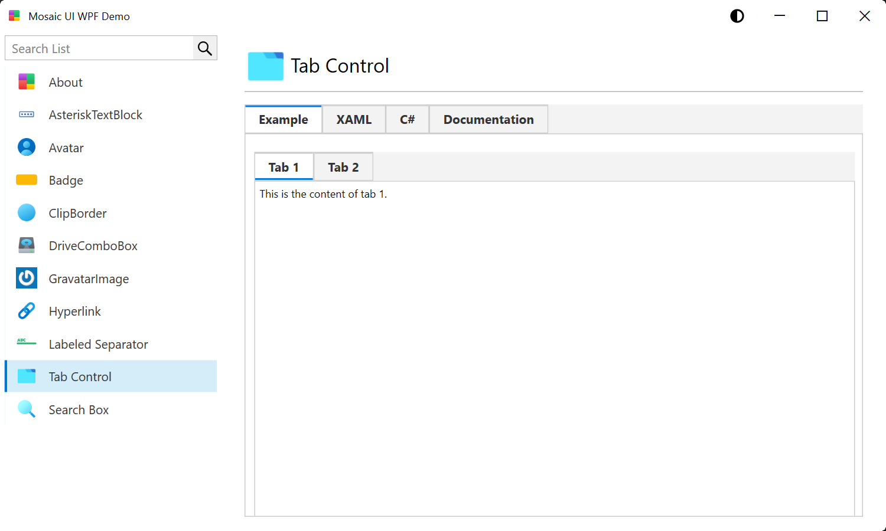

#  Mosaic UI for WPF

Mosaic UI for WPF is a control library that seeks to provide compartmentalized controls that if needed could be easily 
extracted from this project and included in your own.

Almost every WPF UI kit contains a way to theme that's custom and unique to their framework.  This project is trying to
provide enough themeing options that you could use it by itself but not tether all of the controls to it so you could
include it, or parts of it in other projects.

If you find this project interesting or useful, give it a star.

**Note**: There will be frequent changes to the styles in the initial part of this project.

## Dark Theme

## Light Theme

