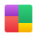

#  Mosaic UI for WPF

Mosaic UI for WPF is a control library that seeks to provide compartmentalized controls that if needed could be easily extracted from this project and included in your own.

Almost every WPF UI kit contains a way to theme that's custom and unique to their framework, it makes mixing and matching controls sometimes cumbersome. This project is trying to provide enough themeing options that you could use it by itself but not tether all of the controls to it so you could include it, or parts of it in other projects that use other UI libraries.  I'll also be providing basic examples of how to use each control so you've got a copy/paste reference to start from and a working demo app to quickly browse and try out controls.

WPF is a great, mature technology that will be with us for a long time now that's part of .NET Core.  WPF's current and future longevity are one of its strengths.  If you're writing a hobby project you want to be around in 10 years, WPF is a great choice.  Credit to the dotnet developer team for bringing it the modern .NET stack.

If you find this project interesting or useful, please give it a star.

> Note: Expect frequent updates to the styling system during the early stages of this project.
> I’m currently exploring various theming patterns through a process of experimentation. I've concluded that customizing the default control templates for native WPF controls is necessary; these will be provided in a separate ResourceDictionary.
> Previously, I overrode SystemColors, but this approach proved too invasive—particularly for applications aiming to coexist with other UI frameworks without conflict.  Also, there are many stock controls that use static resources or hard coded colors so SystemColors gets you some of the way there, but not all of the way

A final note, if you have a useful reusable (mostly) compartmentalized control you want to share and be creditted for, feel free to put in a pull request and I'll look at it.

## Dark Theme

## Light Theme

## Solution Projects

| Feature                | Description                                                                                                                            |
|------------------------|-----------------------------------------------------------------------------------------------------------------------------------------|
| Mosaic.UI.Wpf          | The control library.                                                                                                                    |
| MosaicWpfDemo          | The main demo project that houses examples and snippets of each control in the library as well as usage of other types and behaviors.   |

## Included Controls

The following table lists the controls found in `src/Mosaic.UI.Wpf/Controls` and their class descriptions (from XML comments).

| Control | Description |
|---|---|
| AdaptiveImage | Image that adapts its colors to match app/OS theme. Intended purpose is to be used for icons to be able to adapt. |
| AsteriskTextBlock | A text block that displays asterisks for each character in its text property. |
| Avatar | Represents a customizable avatar control that displays content with support for corner radius and template selection. |
| Badge | A badge component. |
| BindablePasswordBox | Represents a password input control that supports data binding for the password value. |
| ChatThread | A chat thread control which shows sent and received messages in a single thread format. |
| ClipBorder | Border which allows Clipping to its border. Useful especially when you need to clip to round corners. |
| ColorPicker | A color picker UserControl that allows users to select colors from presets or enter hex values. |
| EditableTextBlock | Represents a control that displays text in a non-editable mode and allows users to switch to an editable mode to modify the text. The control supports double-click editing, text trimming, and customizable appearance. |
| FlipPanel | A flip panel component that can display two different content sides and animate between them. |
| GravatarImage | Displays a Gravatar Image for a specified email address. |
| HexColorTextBox | A ComboBox-based control that allows editing and selecting colors using hex strings (supports #RGB, #RRGGBB, #AARRGGBB) and named brushes. |
| Hyperlink | Represents a hyperlink control that displays text and provides navigation functionality. |
| InertiaScrollViewer | Represents a scroll viewer that supports inertia-based scrolling animations. |
| InfoCard | An info card with a highlight color on the left hand side. |
| LabeledSeparator | A labeled separator. |
| NumericTextBox | TextBox that only allows digits, minus sign and a decimal point. |
| PropertyGrid | A control that displays the properties of an object in a grid format. |
| SearchBox | A custom TextBox tailored for searching or filtering. |
| SettingsItem | A settings item control. |
| ShadowPanel | A panel control that applies a drop shadow effect to its child content. Provides properties to control shadow elevation and density/thickness. |
| Shield | A shield component (shows a property and a value). |
| SideMenu | Represents a side menu control that displays a collection of menu items and allows item selection. |
| SimpleStackPanel | Arranges child elements into a single line that can be oriented horizontally or vertically that is more efficient that the normal StackPanel. |
| SmallPanel | Represents a custom panel that arranges its child elements in a single layer and ensures that each child is measured and arranged within the available space. |
| StopwatchDisplay | Represents a stopwatch control that provides functionality to display a stopwatch timer as UI element. |
| StringListEditor | A StringListEditor component. |
| SymbolRating | A symbol rating component. |
| SystemDropShadowChrome | Creates a theme specific look for drop shadow effects. |
| TabControl | Represents a tab control that allows users to switch between multiple tabs. |
| ToggleButton | Represents a button control that can switch between two states: checked and unchecked. This implementation looks like a theme styled switch. |
| ToggleSwitch | Represents a toggle switch control that allows users to switch between two states, such as "On" and "Off". |
| TypingProgress | Represents a control that visually indicates typing progress, typically used in chat or messaging scenarios. |
