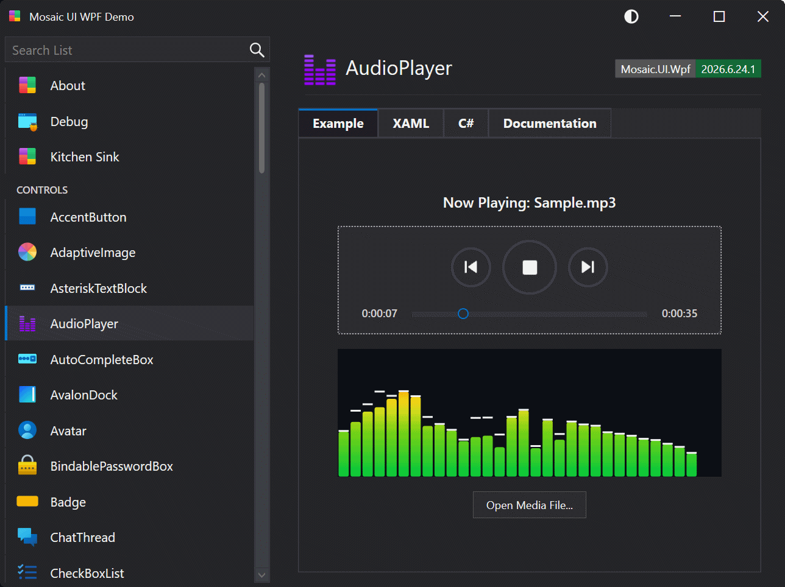

# AudioPlayer

An audio player control with a familiar transport layout: a centered Previous / Play-Stop / Next button row above a full-width seek slider flanked by current playback time and total track length. Backed by MediaPlayer and manages an internal playlist.

