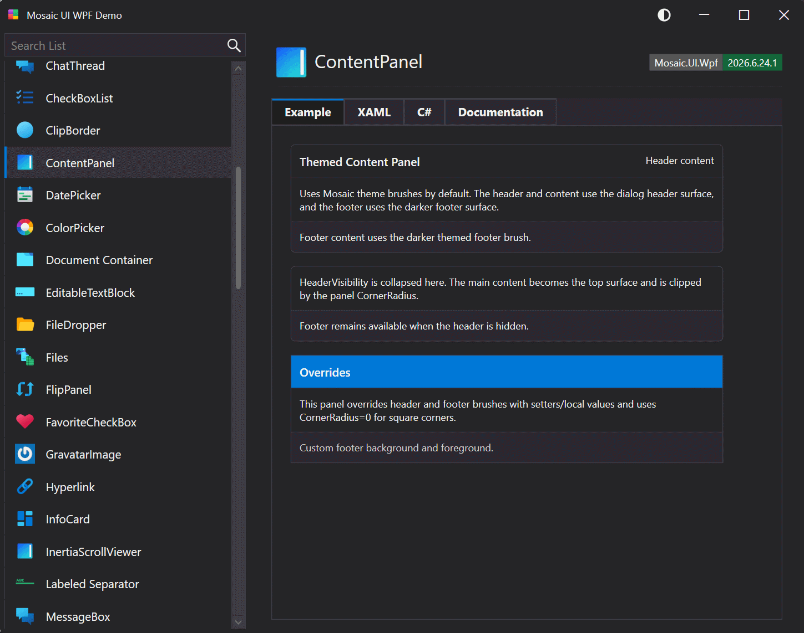

# ContentPanel

A content panel with optional header and footer areas, configurable separators, corner radius, and header/footer brushes. Setting `ShowChevron` adds a chevron to the left of the header that animates the content and footer open and closed; the state is exposed through the two-way `IsOpen` property.

