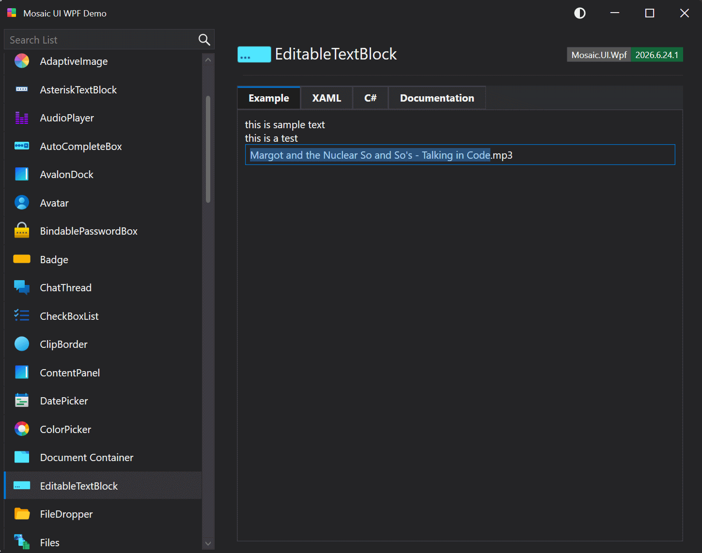

# EditableTextBlock

Represents a control that displays text in a non-editable mode and allows users to switch to an editable mode to modify the text. The control supports double-click editing, text trimming, and customizable appearance.

