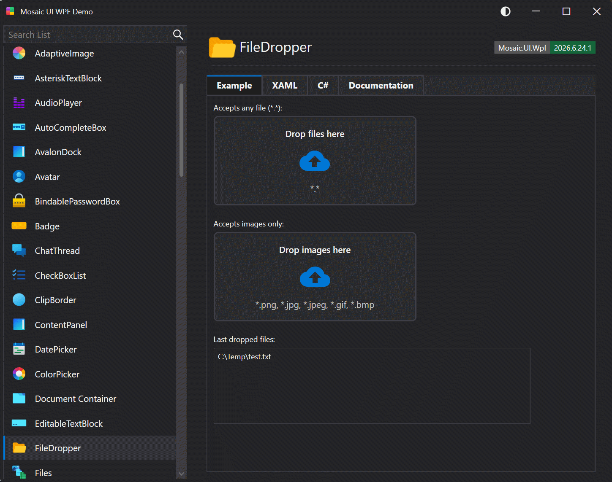

# FileDropper

A drop target that accepts files dragged from the operating system. Displays a prompt, an upload icon, and accepted file types. The border turns green for valid files and red for invalid files. Raises a FileDrop event when files are dropped.

