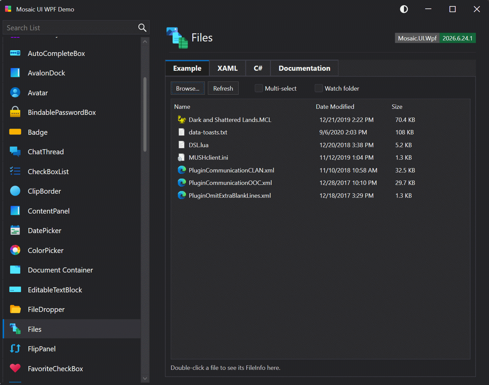

# Files

The `Files` control is a lookless `Control` that presents the contents of a directory in a familiar,
Explorer-style three-column list: **Name** (with the operating-system shell icon for the file type),
**Date Modified**, and **Size** (rendered in friendly units such as `525 KB` or `2.1 MB`). When folder
navigation is enabled it also lists sub-folders and a `..` parent entry, allowing the user to browse a
directory tree one level at a time. It supports single or multiple selection, column sorting, an optional
file-system watcher that keeps the listing live, and a configurable navigation boundary that can confine
the user to a chosen subtree.



**Namespace:** `Mosaic.UI.Wpf.Controls`
**Assembly:** `Mosaic.UI.Wpf`
**XAML namespace:** `http://schemas.apexgate.net/wpf/mosaic-ui` (prefix `mosaic`)

## Remarks

`Files` is a templated (lookless) control built on `Control`, so its appearance is defined entirely by the
default `ControlTemplate` in the theme and can be fully restyled without subclassing. Internally the listing
is presented by a `ListView`/`GridView` (the `PART_ListView` template part) bound to the read-only
[`Items`](#items) collection.

The control distinguishes two kinds of rows:

* **Files** — display the shell icon associated with the file type and raise
  [`FileDoubleClick`](#filedoubleclick) (and run [`FileActivatedCommand`](#fileactivatedcommand)) when
  activated.
* **Folders** — shown only when [`ShowFolders`](#showfolders) is `true`. Each sub-folder, plus a leading
  `..` parent entry, is displayed with a folder icon. Activating a folder navigates into it (the `..` entry
  navigates up), replacing the listing with that folder's contents and moving keyboard focus into the list.
  This is a flat, single-level view — not a tree.

Navigation is resilient: if a folder cannot be opened (for example it was deleted, or access is denied), the
control does **not** throw into the host application. Instead it remains on the current folder, raises the
[`NavigateError`](#navigateerror) event with the offending path and exception, and — when
[`ShowNavigateErrorMessageBox`](#shownavigateerrormessagebox) is `true` — shows a warning message box with
the error text.

Activation works identically for mouse and keyboard: double-clicking a row or pressing <kbd>Enter</kbd> on
the selected row triggers the same behavior.

## Syntax

```xml
<mosaic:Files
    DirectoryPath="C:\Users\Public\Music"
    Filter="*.mp3"
    ShowFolders="True"
    RootDirectory="C:\Users\Public\Music"
    SelectionMode="Extended"
    EnableFileWatcher="True"
    FileDoubleClick="OnFileDoubleClick"
    NavigateError="OnNavigateError" />
```

## Properties

| Property | Type | Default | Description |
| --- | --- | --- | --- |
| <a id="directorypath"></a>`DirectoryPath` | `string` | `string.Empty` | The full path of the directory whose contents are listed. Updated automatically as the user navigates folders. |
| `Filter` | `string` | `"*"` | The search pattern applied to **files** (for example `*.txt`). Does not affect folders. |
| `ShowHiddenFiles` | `bool` | `false` | Whether files and folders marked *Hidden* or *System* are included. |
| `SelectionMode` | `SelectionMode` | `Single` | Whether the list allows `Single`, `Multiple`, or `Extended` selection. |
| `EnableFileWatcher` | `bool` | `false` | When `true`, a `FileSystemWatcher` monitors the directory and refreshes the listing automatically (coalescing bursts of changes). |
| <a id="showfolders"></a>`ShowFolders` | `bool` | `true` | Enables folder navigation: sub-folders and a `..` parent entry are listed, and activating a folder navigates into it. Set to `false` to list files only. |
| <a id="rootdirectory"></a>`RootDirectory` | `string` | `string.Empty` | Bounds upward navigation. When set, the user may browse this folder and its sub-folders but cannot navigate above it — the `..` entry is hidden once the listing reaches this folder, and any attempt to navigate outside the subtree is ignored. Empty allows navigation anywhere. Has no effect when `ShowFolders` is `false`. |
| <a id="shownavigateerrormessagebox"></a>`ShowNavigateErrorMessageBox` | `bool` | `true` | Whether a warning `MessageBox` showing the error text is displayed when navigation fails. Independent of the `NavigateError` event, which is always raised. |
| `SelectedItem` | `FileItem?` | `null` | The currently selected row (two-way bindable). In multi-selection mode this reflects the primary selection. |
| <a id="items"></a>`Items` | `ObservableCollection<FileItem>` | *(read-only)* | The rows currently displayed. Populated and reconciled by the control. |
| <a id="fileactivatedcommand"></a>`FileActivatedCommand` | `ICommand?` | `null` | A command executed when a **file** is activated; the command parameter is the activated `FileInfo`. |

### Read-only computed properties

| Property | Type | Description |
| --- | --- | --- |
| `SelectedFile` | `FileInfo?` | The `FileInfo` for the selected row, or `null` if nothing is selected or the selection is a folder. |
| `SelectedFiles` | `IReadOnlyList<FileInfo>` | The `FileInfo` for every selected row, excluding folders. |

### Attached property

| Property | Type | Description |
| --- | --- | --- |
| `Files.SortMemberPath` | `string` | Set on a `GridViewColumn` to declare which `FileItem` property the column sorts by (`Name`, `DateModified`, `Size`). Sorting uses the typed value, so dates and sizes order correctly. |

## Events

| Event | Arguments | Description |
| --- | --- | --- |
| <a id="filedoubleclick"></a>`FileDoubleClick` | `FileActivatedEventArgs` | Raised when a **file** row is activated (double-click or <kbd>Enter</kbd>). Carries the activated `FileInfo`. |
| `SelectionChanged` | `SelectionChangedEventArgs` | Raised when the set of selected rows changes. |
| <a id="navigateerror"></a>`NavigateError` | `FilesNavigateErrorEventArgs` | Raised when folder navigation fails. Carries the attempted `Path` and the `Exception`. The failure is handled gracefully and never propagates to the host application. |

## Methods

| Method | Description |
| --- | --- |
| `Refresh()` | Re-reads the directory and reconciles the listing with the current contents on disk, updating existing rows in place (preserving selection) where possible. |
| `SortBy(string memberPath, ListSortDirection direction)` | Sorts the listing by a `FileItem` property (`Name`, `DateModified`, `Size`) and updates the column sort indicator. Folders remain grouped above files. |

## The `FileItem` row model

Each row is a `FileItem`. The most commonly used members are:

| Member | Type | Description |
| --- | --- | --- |
| `Name` | `string` | The display name (the file or folder name, or `..` for the parent entry). |
| `FullPath` | `string` | The full path on disk. |
| `DateModified` / `DateModifiedDisplay` | `DateTime` / `string` | The last-write time and its friendly display string. |
| `Size` / `SizeDisplay` | `long` / `string` | The size in bytes and its friendly display string. Empty for folders. |
| `Icon` | `ImageSource?` | The shell icon (files) or folder icon (folders). |
| `IsDirectory` | `bool` | `true` when the row is a folder (including the `..` entry). |
| `IsParentNavigation` | `bool` | `true` only for the `..` parent entry. |
| `FileInfo` | `FileInfo` | A fresh `FileInfo` for the row's path. |

## Examples

### Basic file browser

```xml
<mosaic:Files
    DirectoryPath="{Binding CurrentFolder}"
    FileDoubleClick="OnFileDoubleClick" />
```

```csharp
private void OnFileDoubleClick(object sender, FileActivatedEventArgs e)
{
    // e.File is the FileInfo that was activated.
    Process.Start(new ProcessStartInfo(e.File.FullName) { UseShellExecute = true });
}
```

### Confining the user to a folder (sandbox)

Allow the user to browse the *Playlists* folder and everything beneath it, but never above it. The `..`
entry disappears once the listing reaches the root, and programmatic or accidental attempts to escape the
subtree are ignored.

```xml
<mosaic:Files
    DirectoryPath="C:\Media\Playlists"
    RootDirectory="C:\Media\Playlists"
    ShowFolders="True"
    Filter="*.m3u" />
```

### Handling navigation errors yourself

Suppress the built-in message box and surface failures through your own application's notification system.

```xml
<mosaic:Files
    x:Name="Browser"
    ShowNavigateErrorMessageBox="False"
    NavigateError="OnNavigateError" />
```

```csharp
private void OnNavigateError(object sender, FilesNavigateErrorEventArgs e)
{
    _statusBar.ShowWarning($"Couldn't open '{e.Path}': {e.Exception.Message}");
}
```

### MVVM activation command

```xml
<mosaic:Files
    DirectoryPath="{Binding CurrentFolder}"
    FileActivatedCommand="{Binding OpenFileCommand}" />
```

```csharp
public IRelayCommand<FileInfo> OpenFileCommand { get; }
// ... OpenFileCommand executes with the activated FileInfo as its parameter.
```

## Keyboard

| Key | Action |
| --- | --- |
| <kbd>Up</kbd> / <kbd>Down</kbd> | Move the selection between rows. |
| <kbd>Enter</kbd> | Activate the selected row — navigate into a folder (or up via `..`), or raise `FileDoubleClick` for a file. |
| Column header click | Sort by that column; click again to reverse the direction. |

## Accessibility

`Files` provides a `FilesAutomationPeer`, and the underlying `ListView`/`ListViewItem` infrastructure
exposes standard selection and item patterns to assistive technologies. All activation available via the
mouse is also reachable from the keyboard.

## Theming

The control draws its background, foreground, and border from `MosaicTheme` tokens via `DynamicResource`,
so it follows the active Light, Dark, or High Contrast theme automatically. Because it is lookless, the
entire template can be replaced for bespoke presentations.
