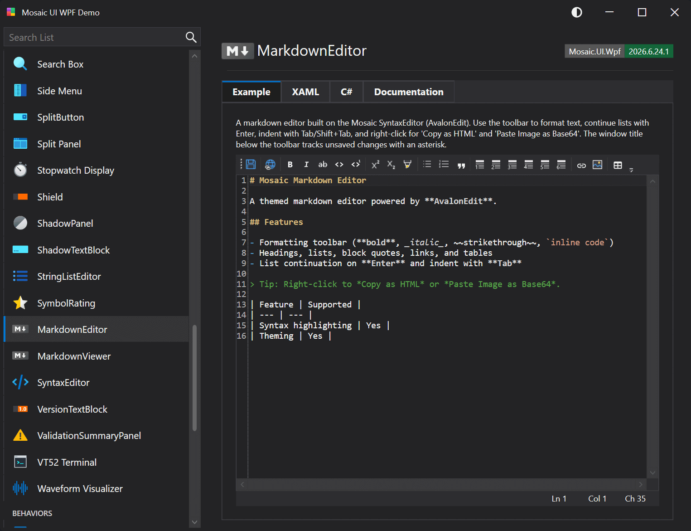

# MarkdownEditor

A self-contained markdown editor built on the Mosaic SyntaxEditor (AvalonEdit). Provides a formatting toolbar, list/heading helpers, markdown-aware key handling, an extended context menu, and document modification tracking.

