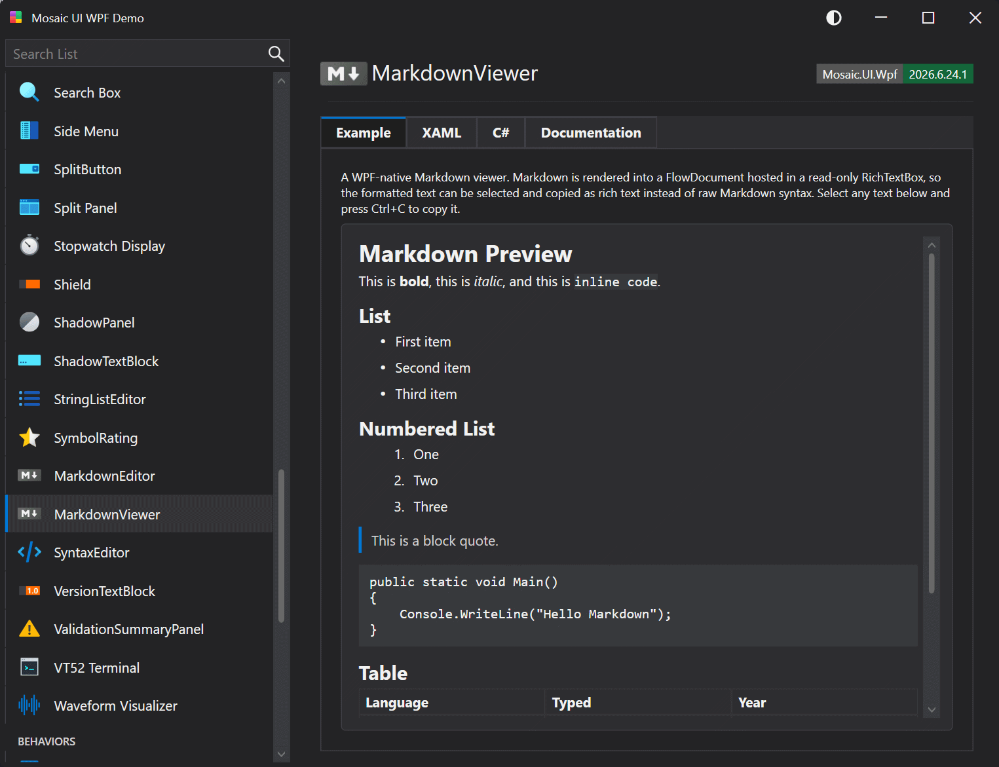

# MarkdownViewer

A lookless, WPF-native Markdown viewer that renders Markdown text into a FlowDocument hosted in a read-only RichTextBox so formatted content can be selected and copied as rich text.

