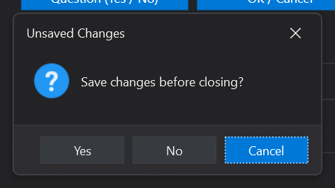

# MessageBox

A themed, drop-in replacement for System.Windows.MessageBox. Mirrors the full set of Show overloads and reuses the standard WPF dialog enums. Switch with a single using alias. Honors the active Mosaic light/dark/high-contrast theme.

