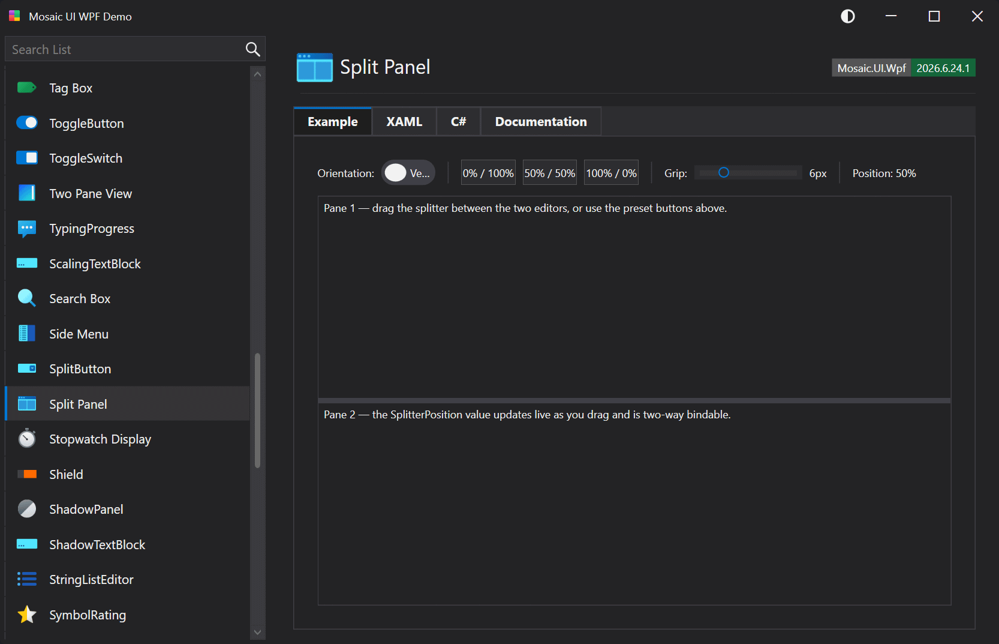

# SplitPanel

A two-pane container whose panes are separated by a draggable GridSplitter. The proportion of space allocated to the first pane is controlled by the two-way SplitterPosition property (0.0–1.0). Supports both vertical (top/bottom) and horizontal (side-by-side) orientation.

