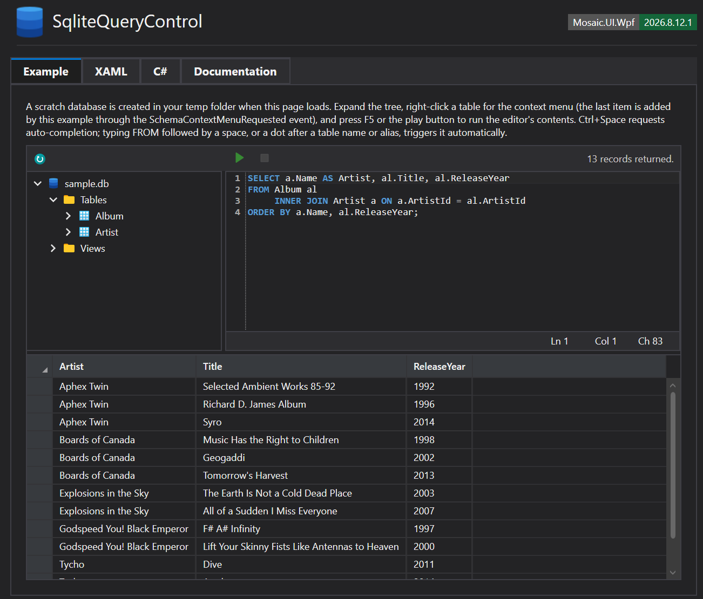

# SqliteQueryControl

A SQLite query workbench in a single control: a database explorer tree, a SQL editor with schema-aware auto-completion, and a results grid, wired to a transport-style run/cancel tool bar.



The control is composed from other Mosaic controls rather than reinventing them — the editor is a [`SyntaxEditor`](./SyntaxEditor.md) with SQLite highlighting, and the run/cancel buttons are an [`ExecutionControl`](./ExecutionControl.md). The results grid and explorer reuse the Mosaic native control styles, scoped to the control's own template so they look right whether or not `ThemeManager.Native` is enabled globally.

## Usage

Point the control at a database file and the schema loads automatically:

```xml
<mosaic:SqliteQueryControl DatabaseFilePath="{Binding DatabasePath}" />
```

`DatabaseFilePath` is a convenience over `ConnectionString`; setting it builds a `Data Source={path}` connection string. Set `ConnectionString` directly when you need connection options:

```xml
<mosaic:SqliteQueryControl ConnectionString="Data Source=catalog.db;Mode=ReadOnly;Cache=Shared" />
```

Either property can be assigned at any time, and assigning it reloads the explorer. To open a database and await the schema load, use `OpenDatabaseAsync`:

```csharp
await this.QueryControl.OpenDatabaseAsync(path);
```

## Running queries

Press **F5** or the play button. When text is selected, only the selection runs — otherwise the whole document does. `QueryText` binds two way and stays synchronized with the editor, so a query can equally be supplied from a view model:

```xml
<mosaic:SqliteQueryControl
    DatabaseFilePath="{Binding DatabasePath}"
    QueryText="{Binding Sql, Mode=TwoWay}"
    StatusText="{Binding Status, Mode=OneWayToSource}" />
```

Queries run on a background thread and are cancellable with the stop button, which is enabled only while one is running. `ExecuteQueryAsync` runs arbitrary SQL from code and completes when the query finishes:

```csharp
await this.QueryControl.ExecuteQueryAsync("SELECT * FROM Album ORDER BY ReleaseYear DESC;");
```

Only the first result set is shown. `StatusText` reports the outcome — a record count, `Query cancelled.`, or the error message — and `QueryCompleted` is raised however the query ended.

> **On cancellation.** `Microsoft.Data.Sqlite` is synchronous underneath. The token is honored between reader steps and by calling `SqliteCommand.Cancel()`, so cancellation is cooperative: a single long-running statement such as a large table scan may not stop the instant you press the button.

By default the schema is reloaded after every query so DDL typed into the editor shows up in the explorer immediately. Set `RefreshSchemaAfterQuery` to `false` against a large database where that round trip is not worth paying for on every run.

## Database explorer

The tree shows the database root, a **Tables** and a **Views** folder, each object, and each object's columns annotated with type and primary-key role. The refresh button in the tool bar above it reloads the schema, as does the `RefreshSchemaCommand`.

Right-clicking a table or view gives you:

| Item | |
|---|---|
| **Select All Rows** | Runs `SELECT * FROM …` immediately. |
| **Select Top N Rows** | Same, with `LIMIT` set from `RowLimit` (default 1,000). |
| **Generate SQL ▸** | Appends a generated statement to the editor rather than running it: Select, Insert, Update, and the object's `CREATE` statement. Views offer Select and Create View. |

Generated `INSERT` and `UPDATE` statements are parameterized and annotate each column with its declared type; `UPDATE` builds its `WHERE` clause from the primary key, or leaves a comment where no key is declared. Right-clicking a column offers **Copy Column Name** and **Select Distinct Values**.

## Extending the context menu

`SchemaContextMenuRequested` follows the same model as [`SyntaxEditor.ContextMenuRequested`](./SyntaxEditor.md). It is raised after the standard items are in place but before the menu is shown, so a handler can append, remove, or reorder items. The menu is rebuilt on every open, so changes never accumulate across right-clicks.

```csharp
private void OnSchemaContextMenuRequested(object? sender, SqliteSchemaContextMenuEventArgs e)
{
    if (e.NodeKind != SqliteSchemaNodeKind.Table || string.IsNullOrEmpty(e.ObjectName))
    {
        return;
    }

    string objectName = e.ObjectName;

    e.ContextMenu.Items.Add(new Separator());

    var item = new MenuItem { Header = "Count Rows" };
    item.Click += async (_, _) => await this.QueryControl.ExecuteQueryAsync($"SELECT COUNT(*) FROM [{objectName}];");
    e.ContextMenu.Items.Add(item);
}
```

`NodeKind` identifies what was clicked (`Database`, `TablesFolder`, `ViewsFolder`, `Table`, `View`, `Field`, or `None` for empty space). `Node` is the bound `SqliteTable`, `SqliteView`, or `SqliteField`, and `ObjectName` resolves to the owning table or view — for a field, the object it belongs to. Set `Cancel` to suppress the menu entirely.

Clearing `e.ContextMenu.Items` and adding your own replaces the standard menu for that node.

## Auto-completion

Completion is offered against the loaded schema and is enabled by default. It triggers on:

* **`FROM`, `JOIN`, `INTO`, `UPDATE`, `TABLE` followed by a space** — tables and views.
* **A dot after an identifier** — the columns of that table or view. Aliases are resolved by scanning the editor for a matching `FROM|JOIN|UPDATE|INTO <object> [AS] <alias>` pair, so `al.` completes to `Album`'s columns in `FROM Album al`. An unrecognized qualifier falls back to every column in the database.
* **Ctrl+Space** — tables and views, at any position.

Each candidate carries a description tool tip: column count for objects, and type, nullability, key role, and default for columns. The popup is themed from the Mosaic tokens and re-resolves them every time it opens, so it follows a theme switch.

Set `AutoCompleteEnabled` to `false` to turn it off.

## Key Properties

| Property | Type | Default | Description |
|---|---|---|---|
| `DatabaseFilePath` | `string?` | `null` | Path of the database file. Setting it builds a `Data Source=` connection string. |
| `ConnectionString` | `string?` | `null` | The connection string. Setting it reloads the schema. |
| `Schema` | `SqliteSchema?` | `null` | Read-only. The schema as of the last refresh; drives the explorer and the completion candidates. |
| `QueryText` | `string` | `""` | The editor's contents. Binds two way by default. |
| `StatusText` | `string` | `"Idle"` | The status message shown beside the run tool bar. |
| `IsQueryExecuting` | `bool` | `false` | Read-only. Whether a query is running. |
| `RefreshSchemaAfterQuery` | `bool` | `true` | Whether the schema is reloaded after every query so DDL shows up in the explorer. |
| `AutoCompleteEnabled` | `bool` | `true` | Whether schema-aware completion is offered in the editor. |
| `RowLimit` | `int` | `1000` | The row count used by the explorer's Select Top N Rows command. |

## Events

| Event | Type | Description |
|---|---|---|
| `SchemaContextMenuRequested` | Routed (`SqliteSchemaContextMenuEventArgs`) | Raised after the standard explorer menu items are built and before the menu is shown. |
| `QueryCompleted` | Routed (`RoutedEventArgs`) | Raised after a query finishes, whether it succeeded, failed, or was cancelled. Inspect `StatusText` for the outcome. |

## Methods and Commands

| Member | Description |
|---|---|
| `OpenDatabaseAsync(string filePath)` | Sets `DatabaseFilePath` and awaits the schema load. |
| `ExecuteQueryAsync(string sql)` | Runs SQL and shows the first result set. Completes when the query finishes. |
| `RefreshSchemaAsync()` | Reloads the schema into the explorer. |
| `ExecuteQueryCommand` | `IAsyncRelayCommand`. Runs the selection, or the whole document when nothing is selected. Cannot execute while a query is running or no database is open. |
| `CancelQueryCommand` | `IRelayCommand`. Cancels the running query. Cannot execute when nothing is running. |
| `RefreshSchemaCommand` | `IAsyncRelayCommand`. Reloads the schema. |

The commands drive the tool bar's enabled state through `CanExecute`, so binding them elsewhere gives the same affordances.

## Keyboard

| | |
|---|---|
| `F5` | Execute the selection, or the whole document when nothing is selected. |
| `Ctrl`+`Space` | Request completion. |
| `Escape` | Dismiss the completion popup. |

The editor also carries the standard [`SyntaxEditor`](./SyntaxEditor.md) chords — comment and uncomment, move line, and the search panel.

## Schema model

`Schema` is an observable model you can bind against directly, independently of the explorer:

| Type | Members |
|---|---|
| `SqliteSchema` | `DatabaseName`, `ConnectionString`, `Tables`, `Views` |
| `SqliteTable` / `SqliteView` | `Name`, `Sql` (the `CREATE` statement SQLite reports), `Fields` |
| `SqliteField` | `ColumnId`, `Name`, `Type`, `NotNull`, `DefaultValue`, `PrimaryKey` |

All four are `ObservableObject` types from the MVVM Community Toolkit. `Type` is the declared type affinity — SQLite is dynamically typed, so it is not a guarantee about the stored values.

## Accessibility

`SqliteQueryControlAutomationPeer` exposes the control as a pane. Every interactive surface is reachable from the keyboard, tool bar buttons carry tool tips that double as their accessible names, and the run and cancel buttons are disabled rather than hidden when they cannot execute.

## Notes

* The control depends on `Microsoft.Data.Sqlite`, which ships as a dependency of `Mosaic.UI.Wpf`.
* Result sets load into a `DataTable` inside a `DataSet` with constraints disabled, so a joined query returning duplicate key values displays rather than throwing.
* Underscores in generated column headers are doubled before display — WPF otherwise treats a single underscore in header content as an access-key marker and swallows it.
* `Dispose()` cancels any running query, detaches the template parts, and releases the cached result set. The control also cancels in-flight work when it is unloaded.
