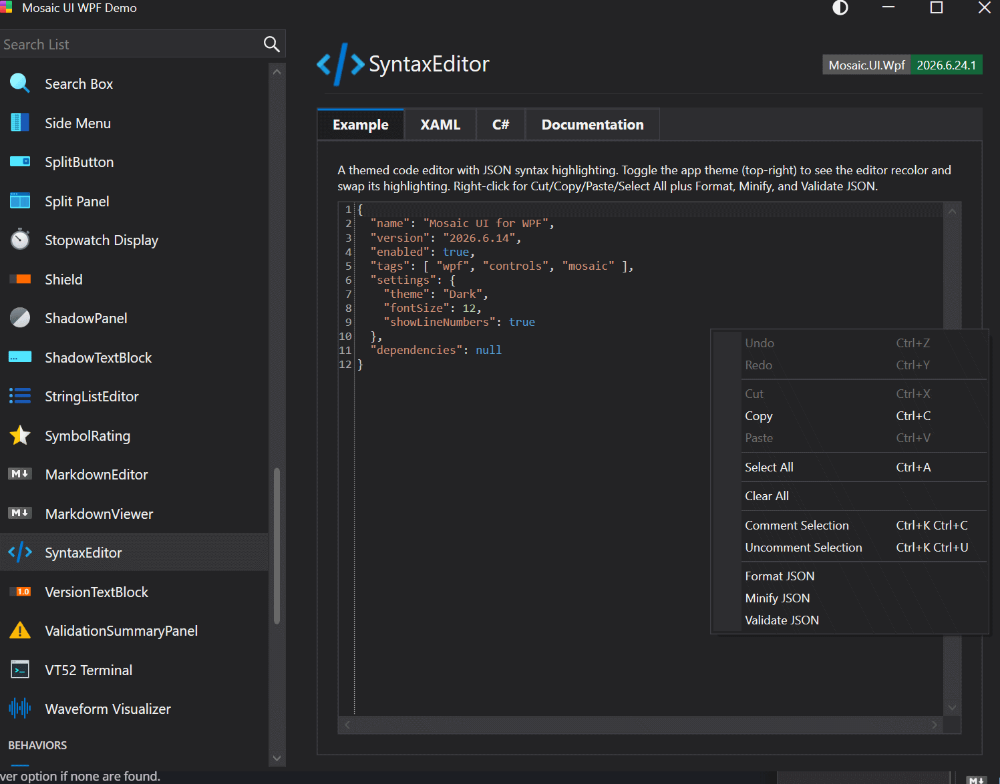

# SyntaxEditor

A code editor built on AvalonEdit that integrates with the Mosaic theming system and provides bundled, theme-aware syntax highlighting selected via the Language property. Includes custom key chords for commenting, uncommenting, and moving lines.

