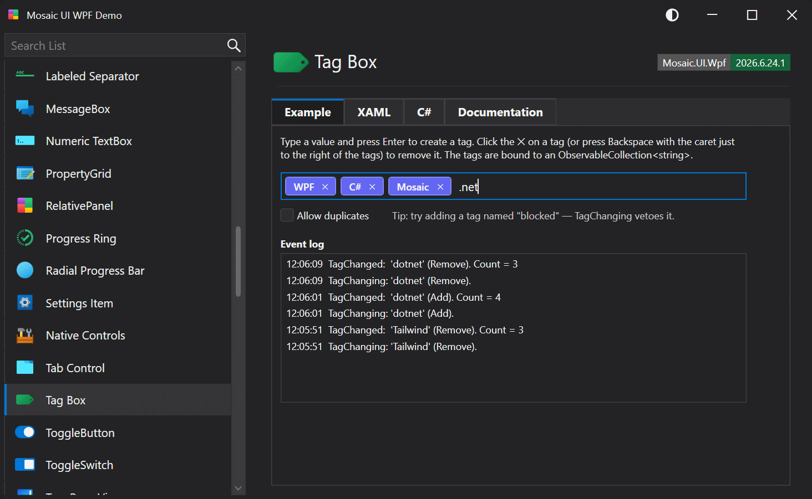

# TagBox

A specialized input control that turns typed text into removable, vibrantly-colored tags. Enter commits the current text as a tag, each tag has an ✕ button, and Backspace removes the last tag. Tags are surfaced through a bindable Tags collection.

