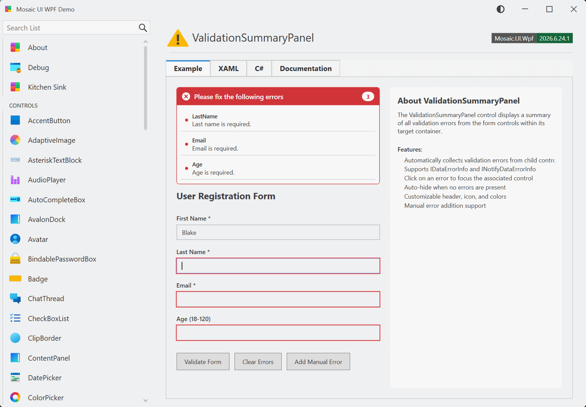

# ValidationSummaryPanel

A validation summary panel that displays all validation errors from child controls in a form. Supports both WPF's built-in validation and IDataErrorInfo/INotifyDataErrorInfo.

